# School District Analysis

## Project Overview
Analysis focused on performance of math and reading schools of school district in preparation of board meeting. Overall percentages were analyzed across school name, school types, school sizes and average budget spending per student. Upon further investigation the board noted that the results for Thomas High School's 9th grade class have been fabricated. As a result, we adjusted analysis to remove those students’ scores and analyzed the data again. Key results are below.
## Resources
### Software
Python 3.7, Anaconda, Jupyter Notebook

## Results
### How is the District Summary affected?
Our original analysis included all students from our data file. Due to potential fraudulent scores of the ninth graders of Thomas High School, we omitted their results and reran our analysis.
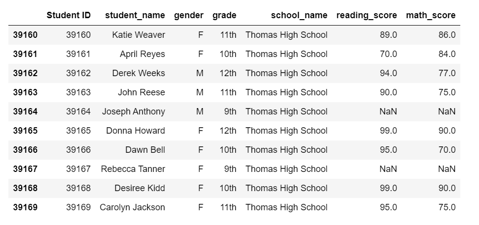

The data frame below is a summary of the district before and after replacing the students’ scores with NaN.
Original Analysis: 
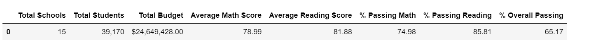
Adjusted Analysis: 
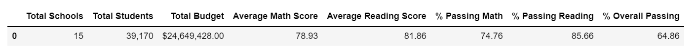
The average scores of math and reading dropped by .06% and .02% respectively which caused the overall passing percentages of math and reading by .22% for math and .15% for reading. Therefore, we can see the passing percentage dropped from to 65.17% to 64.86% overall for the district.
While the changes are miniscule, it is important to note that the 9th graders of Thomas High School only make up about 1.2% of the overall district data, so removing their data overall does not cause too much disruption to our analysis.

### School summary and score replacement effects
Below we will take a closer look at what data was affected by the removal of Thomas High School’s 9th grade scores adn recalculating scores for Thomas High School using only data from grades 10-12.
#### Thomas High School Performance
The top 5 schools with the highest overall passing percentage are all Charter schools, whereas all the bottom 5 performing schools are District schools. Adjusting our analysis did not affect Thomas High Schools ranking at #2.
Original scores:
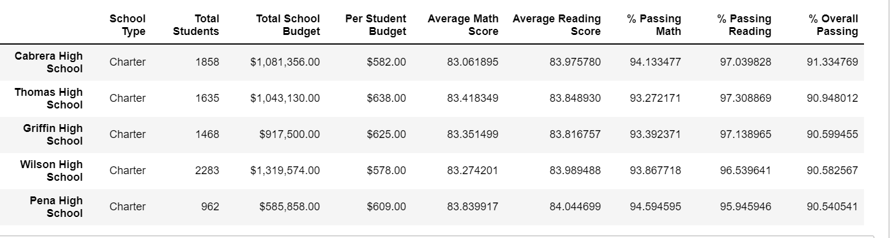
Adjusted Scores:
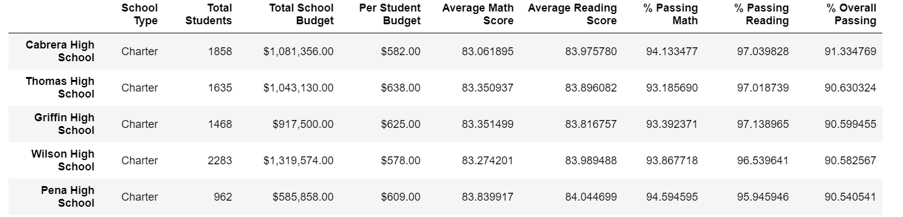
The bottom 5 rankings were not affected as Thomas High School was ranked #2 in both analyses.
Original Scores:
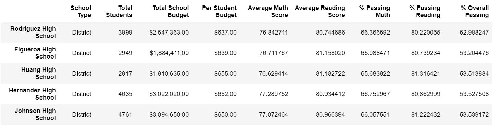
Adjusted Scores:
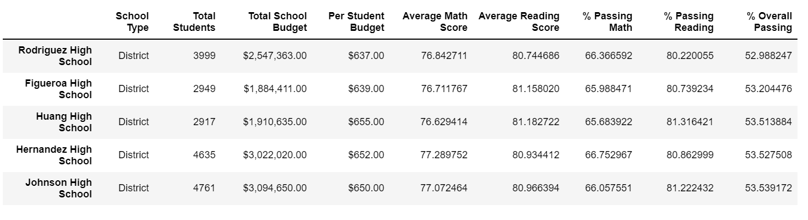

#### Math and reading score by Grade
Original Math Scores By Grade: 
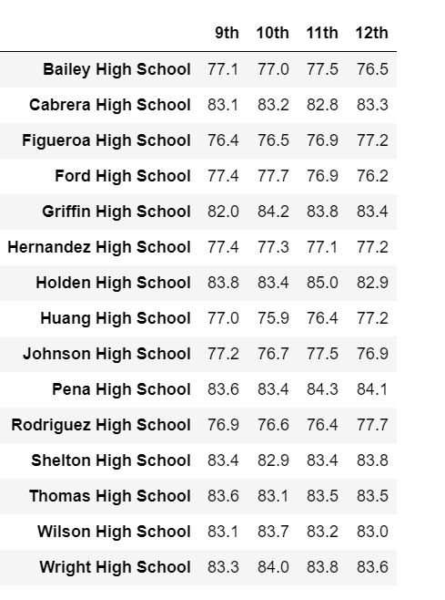
Adjusted Math Scores by Grade:
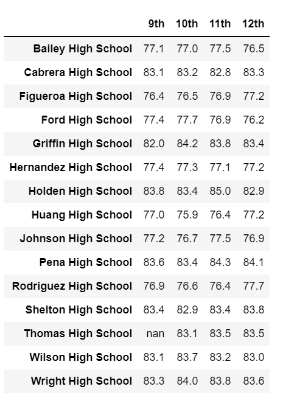
Original Reading Scores by Grade: 
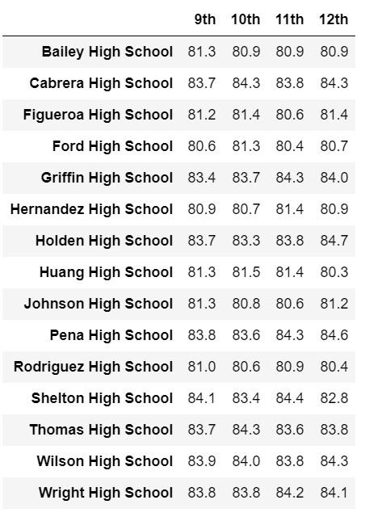
Adjusted Reading Scores by Grade:
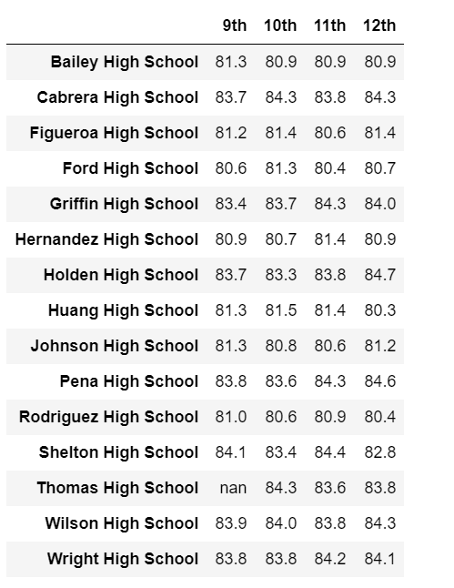
The only change we can see in these data frames is the data from the 9th grade class at Thomas High School. Their scores have been replaced by NaN in the beginning of our analysis.

#### Scores by School Spending
One key result I noticed was that the average scores and passing percentages do not increase as the spending per student increases. There was a slight change in scores by spending groups in the $630-$644 range as this is the group Thomas High School falls in. However, the change is miniscule, where each metric was changed by less than .1 percentage.
Original Spending Summary: 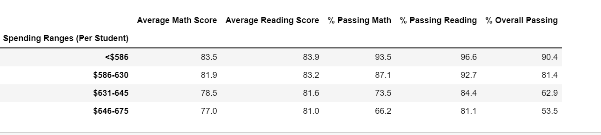
Adjusted Spending Summary: 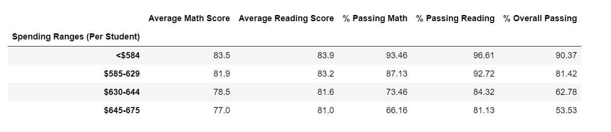

#### Scores by School Type
The Charter schools in this district generally performed better than the district schools in this analysis. Given that Thomas High School was a charter school, we only see a minimal effect in our data as the district school data was unaffected. 
Original Scores by School Type: 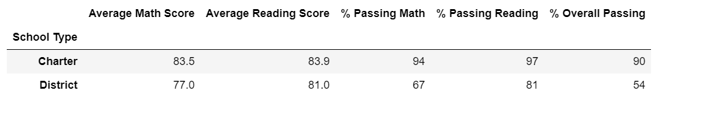
Adjusted Scores by School Type: 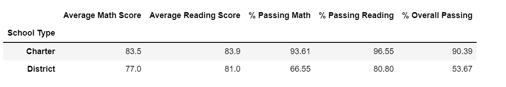

#### Scores by School Size
Original Scores by Size: 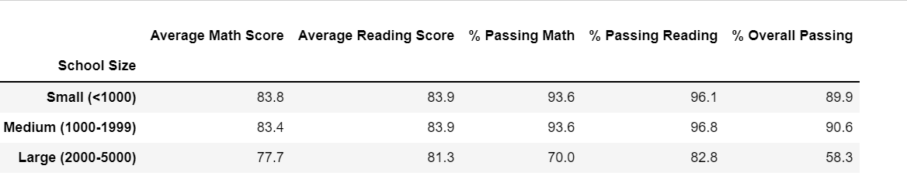
Adjusted Scores by Size: 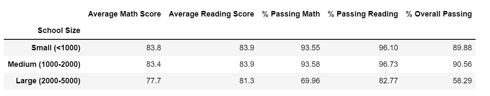

Since Thomas High School has 1,635 students, the only slight change we saw was in the Medium sized range (1000-2000 students). Each metric changed by less than 1 percentage point.

## challenge summary
To conclude, after replacing the math and reading scores of 9th graders from Thomas High School with NaN, we saw significant changes to our district summary. Once we recalculated the scores of only the 10th-12th graders at THS, we realized our analysis was not as off as we originally feared.
* Changes made to math and reading scores decreased the districts overall passing percentage by .31%.
* The overall passing percentage of the spending range $630-$644 decreased by .01%
*	Although the overall passing percentage for Thomas High School was affected, the school rankings remain unchanged.
*	Changes to charter school type for all scores by a fraction of a percentage point did not affect the overall performance of Charter schools vs District Schools.
